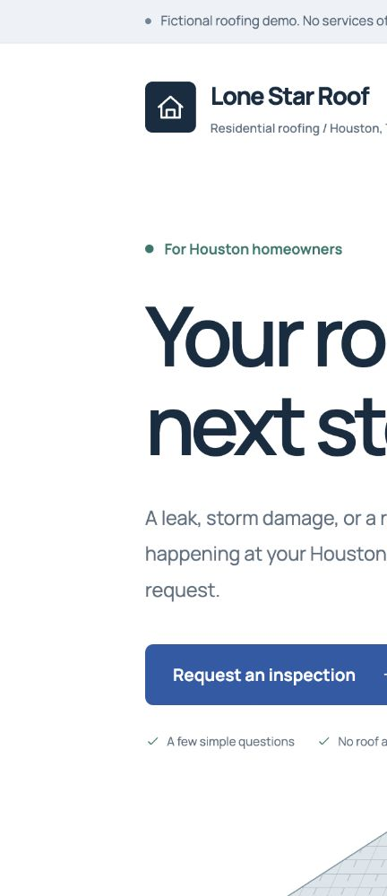
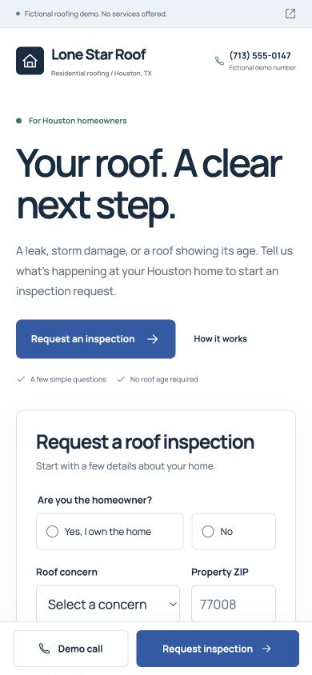
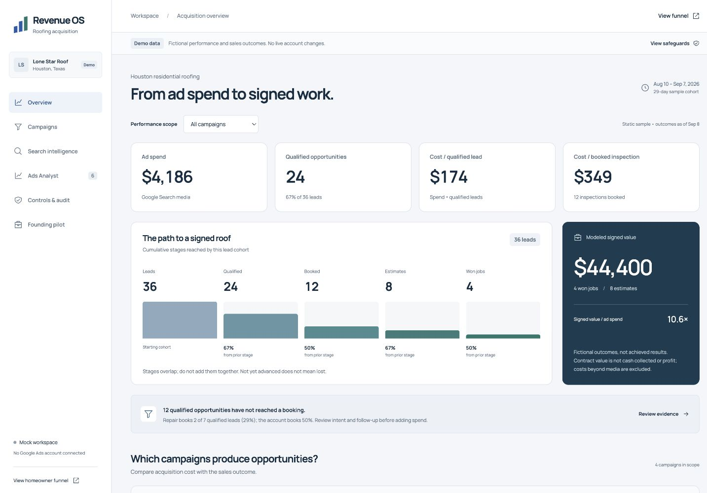
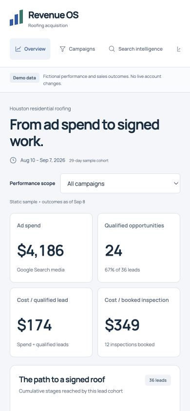

# Roofing Revenue OS

An acquisition-focused mock MVP for a Houston roofing customer-acquisition service. It demonstrates a mobile prospect funnel and a controlled, risk-gated operator control room while keeping every company claim, phone number, dataset and outcome explicitly fictional.

## Product boundaries

- The public funnel stays visibly labeled as a demo until verified real-client data is configured.
- Google Ads and CRM data are mocked. The controlled-write policy is implemented, but there is no live mutation adapter or account connection.
- Success is measured through qualified leads, booked inspections, estimates, wins and revenue—not raw CPL alone.
- No licenses, reviews, warranties, certifications, prices, insurance outcomes or service claims are implied.

## Requirements

- Node.js 20.9 or newer
- npm

## Exact local setup

From the repository root:

```bash
npm ci
cp .env.example .env.local
npm run dev
```

Open:

- Prospect demo: [http://localhost:3000](http://localhost:3000)
- Operator dashboard: [http://localhost:3000/operator](http://localhost:3000/operator)

The current mock MVP does not require populated environment variables. `.env.example` reserves names for future Supabase persistence and separately deployed Google Ads reporting/mutation adapters.

## Verification commands

```bash
npm run test
npm run lint
npm run typecheck
npm run build
npm audit
```

`npm run test` covers attribution capture, homeowner/service-area/contact qualification gates, duplicate/spam rejection, CPQL and downstream funnel math, deterministic analyst thresholds, tracking stop conditions, spend caps, risk/approval policy, provider preflight and complete change-audit behavior.

## What is implemented

- `/` — responsive Houston-specific fictional inspection-request funnel
- `/operator` — campaign-scoped economics, a reconciled cumulative funnel, mobile campaign cards, searchable terms, complete recommendation evidence, a read-only policy lab and audit details
- `/api/leads` — validated mock capture endpoint; it does not persist or route contact data
- `config/client.ts` — one lightweight source for white-label identity and service-area values
- `lib/qualification.ts` — testable v0 qualified-lead rules
- `lib/metrics.ts` — testable funnel economics and conversion rates
- `lib/analyst/` — deterministic rules, configurable samples and evidence-only summarization
- `lib/google-ads/` — typed controlled-write policy, executor, adapter boundary and audit contract
- `lib/mock-data.ts` — clearly separated fictional dashboard data
- Session-scoped attribution continuity for UTM fields, GCLID and GBRAID (30-minute expiry; new tagged visits replace the complete source)
- Intent entry points: `/?intent=repair`, `/?intent=replacement`, `/?intent=storm`
- Qualified / review-needed mock receipt; contact details are never persisted or routed
- Self-hosted Manrope variable font with its OFL license; original architectural illustration, not client work proof

## Client configuration

Edit `config/client.ts` to supply verified identity, phone, market and service-area ZIPs. Keep `isDemo: true` and the demo disclaimer until every public value and claim has been approved. A future implementation should derive the configuration from persistence rather than expanding hard-coded conditions throughout the UI.

## Screenshots

### Prospect funnel





### Operator dashboard





## QA checklist

- [x] Demo disclaimer remains visible above both product surfaces.
- [x] No real contractor or unverified trust claim is presented.
- [x] Prospect page has no document-level horizontal overflow at 390 px or 1440 px.
- [x] Operator campaigns recompose into mobile summary cards with expandable funnel detail.
- [x] Keyboard focus is visible and reduced-motion preferences are respected.
- [x] Click-to-call uses an explicitly fictional 555 demo number.
- [x] Form validation, success state and retry flow work in a production build.
- [x] UTM, GCLID and GBRAID query values are included with mock form submissions.
- [x] Recommendations are generated by deterministic evidence/threshold rules.
- [x] Tracking uncertainty stops optimization instead of guessing.
- [x] Interactive policy scenarios make approval, tracking and provider boundaries explicit without executing or saving changes.
- [x] Every modeled mutation records previous/new values, rationale, metrics, confidence and status.
- [x] Unit tests, TypeScript and the optimized production build pass.
- [ ] Before a real pilot, verify client service area, contact routing, claims, consent language, privacy policy, call tracking and CRM ownership.
- [ ] Before connecting Google Ads, complete a successful reporting request, deploy a separate mutation adapter, persist approvals/audits and test against a Google Ads test account.

## Revamp audit and verification

Read [the critical audit](docs/CRITICAL_AUDIT.md), [ranked opportunities](docs/OPPORTUNITIES.md) and [the verification record](docs/QA_REVAMP.md).

The current local production verification uses `npm run build -- --webpack`; the default Turbopack build stalled locally during this audit. Both use the same Next.js application.

The dashboard is a static 29-day sample cohort. Campaign filters affect the performance and search views; the analyst queue is explicitly account-wide. Stage counts are cumulative and must not be added together. Signed value is fictional contract value, not cash collected or profit.

## Next phases

Google Ads reporting, controlled mutations and future offline conversion uploads remain separate adapters. Qualifying reversible low- and medium-risk actions may auto-execute once a live provider is configured; high-risk actions require explicit approval. See `docs/ADS_ANALYST_SPEC.md` for the complete gates and hard guardrails.
